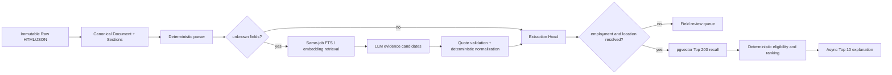

# 职位混合解析、RAG 召回与证据化推荐设计

## 目标

本次升级解决“原文有内容，但结构化事实仍为 unknown”的问题，同时保持既有不变量：Raw 响应不可变、PostgreSQL 是事实来源、LLM 不决定真伪/生命周期/准入/排名、推荐结果可重放、所有展示事实必须可回到原文证据。

首版按以下顺序处理一条职位：

1. 保存原始 HTML/JSON 字节；
2. 物化 Canonical Document，将不同 ATS 页面拆成带定位信息的 Section；
3. 确定性 Parser 与 Normalizer 先提取事实；
4. 仅对仍为 unknown 的字段，在同一 Raw Version 内检索 Section；
5. LLM 只提出带 Quote 和 Section ID 的候选，程序验证 Quote 并确定性规范化；
6. 通过验证后生成不可变 Hybrid Extraction 并显式提升 Extraction Head；
7. 正社員或勤務地仍未解决时标记 `needs_review`，不得进入推荐；
8. Embedding 只召回候选，确定性程序完成准入和排名；
9. Top 10 的日文解释异步生成，失败时保留确定性模板。

## 版本与数据边界

- `canonical_documents` 与 `canonical_document_sections` 只描述一个 Raw Version 的可检索文本视图，不替代 Raw。
- `source_job_extraction_lineage` 记录 deterministic、hybrid、manual 的父子关系；`source_job_extraction_heads` 是每个 Source Job Record 当前唯一的结构化事实入口。
- `Fact<T>` 保留 known、unknown、conflicting；unknown 增加 `unknownReason`：`not_mentioned`、`not_parsed`、`unsupported_format`、`low_confidence`、`provider_failed`。
- Job readiness 与生命周期分离：`ready`、`pending_enrichment`、`needs_review`。
- 所有 Embedding 记录 `model_key`、维度与输入内容 Hash；查询必须同时限制 Model Key 和维度，禁止跨模型比较。
- `ai_tasks` 是可租约、可重试、有预算统计的数据库队列。任务幂等键覆盖输入 Hash、Schema/Parser/Prompt 版本、Model Key 和任务类型。

## 解析、检索与合并

Source Adapter 覆盖 AirWork、engage、HERP、Jobcan、Talentio、HRMOS 和公共 ATS JSON，并统一输出：employment、location、compensation、responsibilities、required/preferred requirements、skills、languages、experience、dates。

字段补充检索严格限制到同一 Canonical Document：先选择显式 DOM/JSON Section，再使用日文/英文关键词和 PostgreSQL FTS；仅当标题不明确或内容分散时使用同文档 Section Embedding。任何跨 Document 的证据候选均拒绝。

LLM 输出必须包含字段、原文 Quote、Section ID、原始值、规范化候选和 required/preferred 分类。程序逐字验证 Quote 属于该 Section。地点、工资、日期和雇用形态最终仍由确定性 Normalizer 生成结构化值。LLM 不能覆盖规则已知值；并发时若 Head 已变化，任务必须基于最新 Head 重新合并或安全结束。

## 推荐与解释

正社員/勤務地 unknown 或 conflicting 会产生 `employment_unresolved` / `location_unresolved`，并排除推荐。工资、技能、语言 unknown 均为 0 分，不再获得中性保底分。

启用语义召回时，Profile 只发送 PII-free SafeProfile 摘要。相同 Embedding Model 下召回 Top 200，并合并尚无 Embedding 但已 ready 的新职位。Saved/Applied 始终按用户状态直接查询，不经过 Top 200 限制。召回后仍使用结构化事实和 Occupation Taxonomy 确定性评分。

Recommendation Run Key 包含 Profile Version、Retrieval Version、Embedding Model Key、Ranking Version 和输入 Job Version 集合。新 Run 的 Top 10 进入解释队列；LLM 只接收 SafeProfile 摘要、确定性结果、已验证事实与 Evidence ID。解释内所有 Evidence ID 必须属于当前 Canonical Job Version，否则整条 AI 解释拒绝。

## 运行与回退

Source Sync Workflow 继续负责抓取、Canonical Document、确定性 Extraction 与 Canonical 物化。AI 任务由独立 Temporal 定时 Workflow 处理，模型故障不拖慢抓取。

三个功能独立开关：

- `AI_ENRICHMENT_ENABLED`
- `SEMANTIC_RETRIEVAL_ENABLED`
- `AI_EXPLANATIONS_ENABLED`

关闭功能或缺少配置时保持确定性模式。回退不删除 Raw、Section、Extraction 或历史 Recommendation Run。

## 验收

- 高风险字段的非 unknown 事实 Evidence 有效率 100%；
- Golden Set 中明确雇用形态和勤務地的精度至少 99%、召回至少 95%；
- 未通过高风险准入的职位进入推荐数为 0；
- Top 200 对人工相关集合的召回至少 95%；
- Top 10 解释引用有效率 100%，LLM 失败不改变排名；
- 相同版本输入可重放得到相同排名。

## 上线 Runbook

1. `pnpm db:verify`：先应用并验证 `0013_hybrid_parsing_rag_and_explanations.sql`。
2. `pnpm parser:golden`：CI 运行 13 个 Source Adapter × 8 个高风险组合，共 104 条最小化合成 Golden Case；完整真实 Raw 不进入 Git。
3. `pnpm parser:replay-hybrid -- --report=output/hybrid-shadow.json`：只读重放现有 Raw Version，输出准入变化，不写 Extraction 或 Canonical。
4. 人工检查报告内全部准入变化后，使用 `pnpm parser:replay-hybrid -- --apply --report=output/hybrid-apply.json` 写入新 Extraction/Head；Raw 和历史 Extraction 不变。
5. 先打开 `AI_ENRICHMENT_ENABLED` 的 Shadow/审核流并复核新 Top 50，再依次打开高风险准入、`SEMANTIC_RETRIEVAL_ENABLED`、`AI_EXPLANATIONS_ENABLED`。

三个开关保持独立；任一 AI 阶段关闭时，确定性解析、准入、排名和模板解释继续工作。
